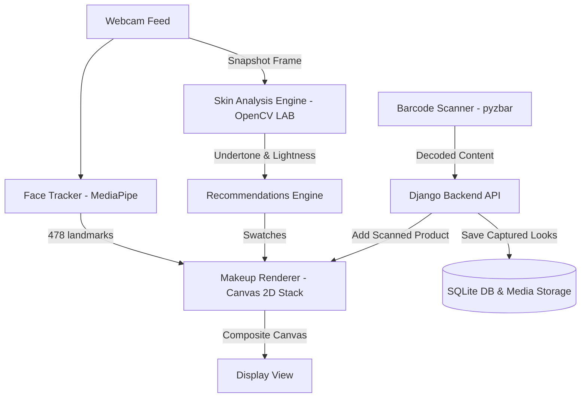
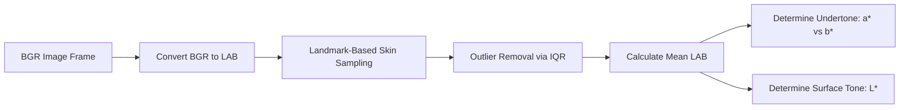

# Shade IQ
# Beauty AR Studio — Real-Time AI Makeup & Skin Tone Analysis


Beauty AR Studio is a premium, real-time virtual makeup try-on and skin analysis platform. Built as a unified full-stack application, it leverages cutting-edge computer vision libraries (MediaPipe Tasks-Vision and OpenCV) alongside a robust Django REST Framework backend. 

The application offers real-time 478-point facial landmark tracking with zero-jitter filtering, GPU-accelerated canvas rendering, dual-mode skin analysis (automated neural/fallback cascades & screen color eye-dropping), a custom Code 128 barcode scanning and inventory integration, and automated reporting services.

---

## 🚀 Key Features

*   **478-Point Face Mesh & Real-Time Tracking**
    *   Powered by the modern `FaceLandmarker` API from `@mediapipe/tasks-vision` delegated directly to the GPU.
    *   Features an **Exponential Moving Average (EMA)** smoothing filter (`smoothing.js`) to eliminate frame jitter and deliver a stable 60 FPS selfie feed.
*   **Snapchat-Style Canvas 2D Blending Stack**
    *   Utilizes a layered offscreen canvas architecture (Video canvas ➔ Offscreen Canvas ➔ Blur Pipeline ➔ final Display Canvas) with Gaussian blur smoothing.
    *   **Lipstick**: Two-tone gradient mapping (outer lip base, deeper shade inner lip) with screen-blended highlight gloss.
    *   **Foundation**: Overlay compositing with a feathered radial mask calibrated to the face oval.
    *   **Blush & Contour**: Subtle multiply blending. Contour applies linear gradients along jawline contours and nose bridge vectors.
    *   **Eyeshadow & Eyeliner**: Advanced geometry mapped between the upper eyelid and the eyebrows with soft gradient fades.
*   **Dual-Mode Skin Tone Analysis Engine**
    *   **Automatic Mode**: Captures webcam frames, isolates forehead and cheek skin sampling coordinates using landmark masks, filters outliers via **Interquartile Range (IQR)**, and converts RGB to the **CIE L\*a\*b\* color space** to detect undertone (Warm/Cool/Neutral) and lightness.
    *   **Manual Mode**: Integrates the native **Google Chrome EyeDropper API**, allowing users to click and sample skin pixels directly from the screen, or choose colors using an inline swatch picker.
*   **Alphanumeric Barcode Inventory Integration**
    *   An independent generator script (`BarCode/barcode_app.py`) parses metadata (product name, category, hexadecimal/RGB color codes) and encodes it into high-density **Code 128 barcodes**.
    *   The backend decodes uploaded barcode images via `pyzbar` and Pillow, auto-saves them as database products, and instantly synchronizes the scanned cosmetics with the active front-end color palettes.
*   **Database Management & Report Exports**
    *   Stores skin analyses, favorite look states, captured media coordinates, and scanned inventory products in a structured SQLite database.
    *   Generates comprehensive, client-ready skin analysis reports (no emojis, optimized for PDF export) detailing undertone, surface tone, lightness, and product recommendations accompanied by user-captured screenshots.
*   **Interactive AI Stylist Avatar**
    *   Integrates a fully interactive 3D glTF avatar with custom animations, voice synthesis (TTS), and speech recognition (STT) for hands-free styling commands.

---

## 📐 Architecture & Data Flow

### Application Architecture


### Skin Tone Analysis Pipeline


---

## 📂 Project Structure

```text
Finals/
├── BarCode/
│   ├── barcode_app.py        # Independent script to generate/decode Code 128 barcodes
│   └── my_content.txt        # Source text representing color metadata for barcodes
├── Character/
│   ├── scene.gltf            # 3D glTF model configuration for the AI Stylist
│   ├── scene.bin             # Binary mesh and animation data for the 3D model
│   └── textures/             # Diffuse maps and materials for the 3D model
├── Reports/
│   └── report-*.txt          # Generated text skin analysis reports
├── backend/
│   ├── manage.py             # Django orchestrator entry point
│   ├── requirements.txt      # Backend Python dependencies
│   ├── db.sqlite3            # SQLite database containing persistence tables
│   ├── Beauty/              # Main Django project settings and routing
│   │   ├── settings.py
│   │   └── urls.py
│   ├── makeup/               # Core application logic, endpoints, and models
│   │   ├── analyzer.py       # Skin Tone Analysis engine (OpenCV LAB + MediaPipe fallback)
│   │   ├── models.py         # DB Schemas: SkinAnalysisResult, FavoriteLook, CapturedPhoto, ScannedProduct
│   │   ├── views.py          # API endpoints (face analysis, barcode decoders, report creators)
│   │   └── management/
│   │       └── commands/
│   │           └── load_products.py # Management command to pre-populate database products
│   └── static/               # Server-served static assets (CSS, JS)
├── frontend/
│   ├── index.html            # Product Landing Page
│   ├── camera.html           # AR Camera Interface and Styling Board
│   ├── css/
│   │   └── styles.css        # Glassmorphic layout styling rules
│   └── js/
│      ├── app.js             # Main Client Orchestrator
│      ├── api.js             # API Fetch client communicating with backend ports
│      ├── faceTracker.js     # MediaPipe FaceLandmarker task loader
│      ├── landmarks.js       # Face indices definitions and scaling coordinate helpers
│      ├── makeupRenderer.js  # Layered Canvas compositing rendering pipeline
│      └── smoothing.js       # Exponential Moving Average filter implementation
└── runningCMD.txt            # Local startup instruction logs
```

---

## 🛢️ Database Schema & Models

The system persists information using Django's ORM mapped to an SQL database:

### 1. `SkinAnalysisResult`
Stores the parameters derived from automated or manual color analyses.
*   `session_id` (*CharField*): Track unique user sessions.
*   `user_name` (*CharField*): Username input.
*   `undertone` (*CharField*): `warm`, `cool`, or `neutral`.
*   `surface_tone` (*CharField*): `fair`, `light`, `medium`, `tan`, or `deep`.
*   `lightness` (*FloatField*): Mapped L\* coordinate.
*   `lab_l`, `lab_a`, `lab_b` (*FloatField*): Extracted CIE LAB values.
*   `recommendations` (*JSONField*): Mapped product shades recommended based on colors.
*   `mode` (*CharField*): `automatic` or `manual`.

### 2. `FavoriteLook`
Saves custom slider calibrations and color selections.
*   `name` (*CharField*): Preset name or user save label.
*   `foundation_color` / `lipstick_color` / `blush_color` / `contour_color` / `bindi_color` (*CharField*): Hex color codes.
*   `foundation_opacity` / `lipstick_opacity` / `blush_opacity` / `contour_opacity` / `bindi_opacity` (*FloatField*): Slider values.

### 3. `CapturedPhoto`
Maintains references to user webcam snapshots.
*   `image` (*ImageField*): Upload path inside `/media/captures/`.
*   `notes` (*TextField*): Custom user notes.
*   `makeup_config` (*JSONField*): Active opacities and hexadecimal values when captured.

### 4. `ScannedProduct`
Contains products read and processed by the barcode decoder.
*   `barcode_data` (*CharField*): Raw scanned content.
*   `product_name` / `category` / `colour_name` / `colour_hex` / `colour_rgb` (*CharField*): Extracted metadata attributes.
*   `barcode_image` (*ImageField*): Scanned file reference.

---

## 🔌 API Endpoints Reference

| Method | Endpoint | Description | Payload Example |
| :--- | :--- | :--- | :--- |
| **POST** | `/api/analyze-face/` | Automatically extracts undertones from a webcam base64 frame. | `{"image": "data:image/jpeg;base64,...", "user_name": "Hari"}` |
| **POST** | `/api/analyze-manual/` | Manually analyzes skin tone from a hex code or RGB values. | `{"hex_color": "#D4A87A", "user_name": "Guest"}` |
| **POST** | `/api/save-look/` | Saves the custom makeup look values. | `{"name": "Sunset Glam", "lipstick_color": "#8C3428", "lipstick_opacity": 0.5}` |
| **GET** | `/api/looks/<session_id>/` | Retrieves saved looks associated with a session ID. | *None* |
| **GET** | `/api/color-database/` | Returns the entire recommendation system database. | *None* |
| **POST** | `/api/capture/` | Saves captured camera screenshots to the user's directory. | `{"image": "...", "user_name": "Hari", "notes": "Tested Lip shade"}` |
| **POST** | `/api/scan-barcode/` | Decodes a barcode image, parses color data, and adds the product. | `{"barcode_image": "data:image/png;base64,...", "user_name": "Hari"}` |
| **POST** | `/api/scan-barcode-manual/` | Adds a barcode manually via formatted text strings. | `{"content": "colour: gold\ncolour_code: #FFD700", "user_name": "Hari"}` |
| **GET** | `/api/products/` | Lists all scanned items currently in the system. | *None* |
| **GET** | `/api/all-data/` | Compiles database records for the system dashboard. | *None* |
| **POST** | `/api/generate-report/` | Compiles a user summary report with an associated image. | `{"user_name": "Hari", "analysis": {}, "image": "..."}` |

---

## 🛠️ Installation & Setup

Ensure you have **Python 3.10+** installed on your system.

### 1. Setup Backend Server
Open a terminal window and navigate to the backend directory to install packages, run migrations, seed initial data, and launch the server:

```powershell
# Navigate to backend
cd backend

# Install dependencies
python -m pip install -r requirements.txt

# Run migrations
python manage.py migrate

# Seed sample product database (Optional)
python manage.py load_products

# Start development server
python manage.py runserver 8000
```
The backend server will run at: `http://127.0.0.1:8000/`.

### 2. Setup Frontend Web Server
Open a second terminal window to serve the static frontend client files:

```powershell
# Navigate to frontend
cd frontend

# Run a simple Python HTTP server
python -m http.server 3000
```
Access the application by opening your browser and navigating to: `http://localhost:3000`.

> [!IMPORTANT]
> **Camera Permissions**: You must allow camera access when prompted by the browser on `camera.html` to enable real-time tracking.
> **Browser Compatibility**: For optimal performance and access to features like the **EyeDropper API**, please use **Google Chrome** or an equivalent Chromium-based browser.

---

## 🏷️ Using the Barcode Integration

To test the barcode registration features:

1. Open `BarCode/my_content.txt` and define your product data details:
   ```text
   colour : coral
   colour_code : #FF7F50
   RGB value : RGB(255,127,80)
   product_name : Matte Coral Lip
   category : lipstick
   ```
2. Navigate to the `BarCode` directory and run the generator script:
   ```bash
   python barcode_app.py
   ```
   This generates a `my_generated_barcode.png` file containing your metadata.
3. In the Web UI on `http://localhost:3000/camera.html`, click **Upload Barcode** and select the generated PNG image.
4. The system will decode the metadata, save it to the backend, and automatically load your color into the lipstick category swatch panel.
